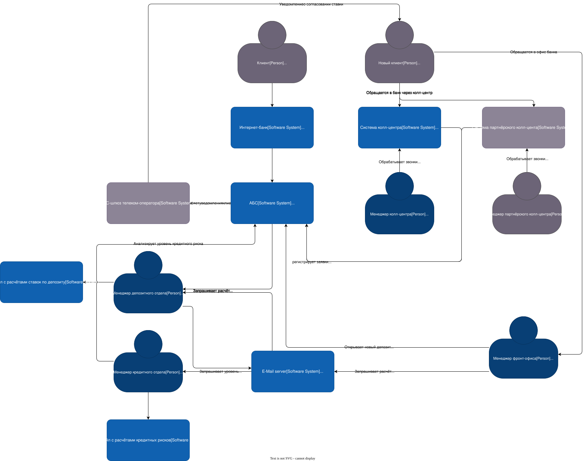
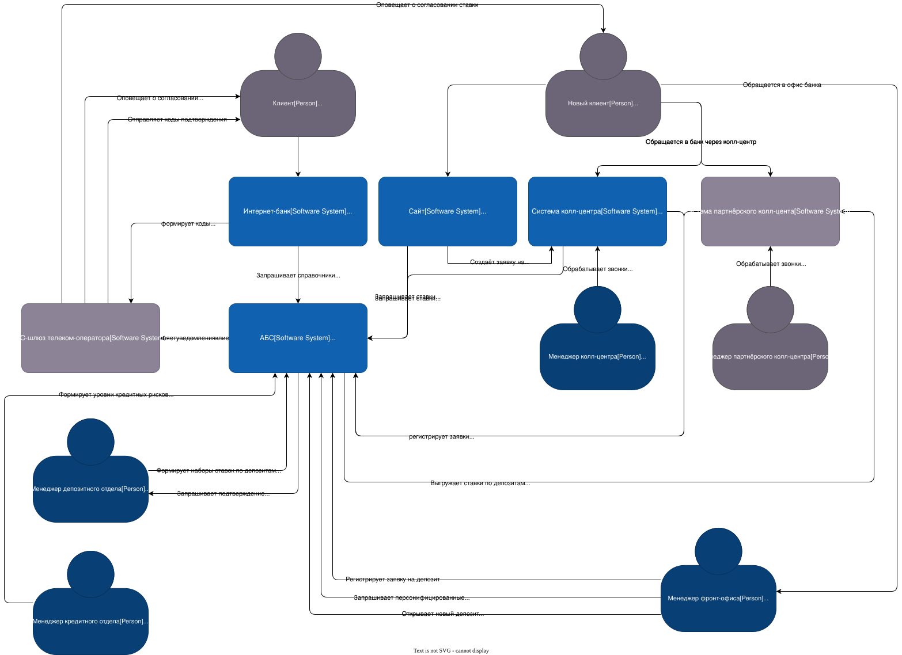
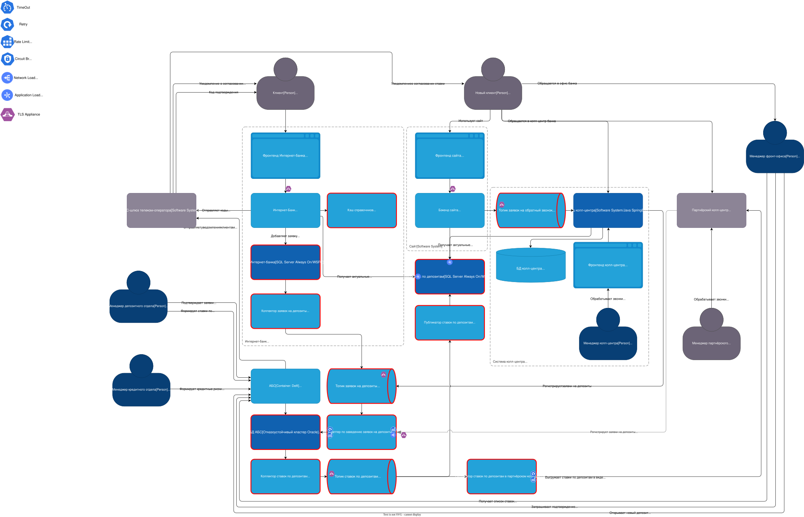

============================
MVP подача заявки на депозит
============================

:Автор: Морозов А.А.
:Дата: 2025-07-09

Функциональные требования
=========================

+-----+------+------------------------------+-------------------+------------------------------------------------------+
|  №  |  F   |Действующие лица или системы  |Use Case           |Описание                                              |
+=====+======+==============================+===================+======================================================+
| UC1 |- F1  |#. Менеджер кредитного отдела |Формирование ставок|Пререквизиты:                                         |
|     |- F8  |#. Менеджер депозитного отдела|по депозитам в АБС |                                                      |
|     |- F9  |#. АБС                        |                   |#. Определены категории клиентов (н-р, "обычный",     |
|     |- F10 |#. Сайт                       |                   |   "VIP уровня 1", "VIP уровня 2"...)                 |
|     |- F11 |#. Интернет-банк              |                   |                                                      |
|     |      |                              |                   |Шаги: `<UC1-steps.rst>`__                             |
|     |      |                              |                   |                                                      |
|     |      |                              |                   |Итог: АБС, сайт, интернет-банк содержат актуальные    |
|     |      |                              |                   |наборы ставок по депозитам для всех категорий клиентов|
+-----+------+------------------------------+-------------------+------------------------------------------------------+
| UC2 |- F2  |#. (Новый) клиент             |Открытие депозита, |Пререквизиты:                                         |
|     |- F3  |#. Сайт                       |инициированное     |                                                      |
|     |- F4  |#. Система колл-центра        |через сайт         |#. Проведён UC1                                       |
|     |      |#. Менеджер колл-центра       |                   |                                                      |
|     |      |#. АБС                        |                   |Шаги: `<UC2-steps.rst>`__                             |
|     |      |#. Менеджер депозитного отдела|                   |                                                      |
|     |      |#. Менеджер фронт-офиса       |                   |Итог: Открыт депозит для нового клиента.              |
|     |      |#. СМС-шлюз телеком-оператора |                   |                                                      |
+-----+------+------------------------------+-------------------+------------------------------------------------------+
| UC3 |- F5  |#. Клиент                     |Открытие депозита, |Пререквизиты:                                         |
|     |- F6  |#. Интернет-банк              |инициированное     |                                                      |
|     |- F7  |#. СМС-шлюз телеком-оператора |через интернет-банк|#. Проведён UC1                                       |
|     |      |#. АБС                        |                   |#. Клиент имеет Р/С с депонированными средствами.     |
|     |      |#. Менеджер депозитного отдела|                   |#. УЗ клиента содержит категорию клиента              |
|     |      |                              |                   |#. клиент аутентифицирован в интернет-банке.          |
|     |      |                              |                   |                                                      |
|     |      |                              |                   |Шаги: `<UC3-steps.rst>`__                             |
|     |      |                              |                   |                                                      |
|     |      |                              |                   |Итог: Открыт депозит без посещения клиентом офиса.    |
+-----+------+------------------------------+-------------------+------------------------------------------------------+

Нефункциональные требования
===========================

=======  ================================================================================
№        Требование
=======  ================================================================================
**U**    **Удобство использования (Usability)**
U1       Использовать единый дизайн и стилистику UI/UX (цвета, брендированные элементы)
U2       Отклик по всем операциям (<10ms)
U3       Интерфейс подачи заявки на депозит максимально удобен для клиента
**R**    **Надёжность (Reliability)**
R1       24/7, 99.9% для интернет-банка
R2       24/7, 99.9% для сайта
R3       24/7, 99.9% для АБС (нечёткая формулировка, м.б., не обязательно)
R4       Обеспечивать отказоустойчивость через 2 ЦОД
**P**    **Производительность (Performance)**
P1       Быстрая (<10ms) загрузка справочников (сейчас <10s)
P2       Горизонтальное масштабирование
P3       Избегать прямой работы с API АБС из-за перегруженности
**S**    **Поддерживаемость (Supportability)**
S1       Использовать знакомые технологии и продукты
S2       Для отправки СМС нужна доработка ядра интернет-банка командой разработки банка
S3       Документирование текущей архитектуры и каждого изменения
**+R**   **+ Ограничения (Restrictions)**
+R1      Шифровать трафик между клиентом и бэкендом интернет-банка
+R2      Шифровать трафик между клиентом и бэкендом сайта
+R3      Шифровать трафик между подсистемами внутри банка
+R4      Если использовать Message Broker, то Kafka.
+R5      Текущая версия платформы Интернет-банка несовместима с Kafka
+R6      Для Delphi нет поддерживаемой библиотеки для Kafka, и, м.б, других компонентов
=======  ================================================================================

Решение
=======

Диаграмма контекста C4 в нынешнем состоянии выглядит так:

Диаграмма контекста C4 для подачи депозитов онлайн на этапе MVP:

Диаграмма контейнеров C4 для подачи депозитов онлайн на этапе MVP:

Пояснения
---------

Для того, чтобы сделать возможным показ персонифицированных ставок по депозитам
в интернет-банке и ставок по депозитам на сайте, необходим проактивный расчёт
кредитных рисков и ставок уполномоченными сотрудниками бэк-офиса.

Для этого предлагаю заранее выработать внутрибанковские критерии для
категоризации клиентов (по уровню подтверждённых доходов, расходов, кредитной
нагрузки, кредитной истории итп). Далее необходимо дополнить профиль клиента
информацией о его категории. Категория клиента пересчитывается на регулярной
основе и при существенном изменении его финансового состояния: поступления
денежных средств, крупных трат, активности, подпадающей под внешнее или
внутрибанковское регулирование итп.

В рамках юз-кейса "Формирование ставок по депозитам в АБС" уполномоченные
сотрудники кредитного отдела регулярно формируют наборы кредитных рисков для
каждой категории клиентов. Уполномоченные сотрудники депозитного отдела на
основании этой информации формируют наборы ставок по депозитам, доступные
различным категориям пользователей. Наборы ставок по депозитам автоматически
публикуются в БД, внешней по отношению к БД АБС. Интернет-банк, и сайт
пользуются этой базой в режиме "только чтение" для получения актуальных ставок
для различных категорий клиентов. Для выполнения требования F3 этот же набор
данных по ставкам необходим менеджерам колл-центров (собственного и
партнёрского) — чуть-чуть забежал вперёд в `задачу 4 <../Task4/ADR.rst>`__.

Для выгрузки ставок в Систему партнёрского колл-центра в виде файлов
используется Публикатор ставок по депозитам в партнёрском колл-центре.

При выработке решения исходил из минимизации необходимых изменений в
существующем коде и использованию уже знакомых технологий (требование S1).
Поэтому в качестве СУБД ставок по депозитам выбран `SQL Server Always On/WSFC`_.
Отказоустойчивая база данных необходима для требований R1 и R2. База
используется в режиме "в основном, read-only", поэтому горизонтальное
масштабирование (P2) реализуется через `встроенные механизмы SQL Server Always On`_.

Для выполнения требования R1 необходима отказоустойчивость БД Интернет-банка.
Для этого предлагаю задействовать технологию `SQL Server Always On/WSFC`_.
Вероятно, такая конфигурация потребует дополнительных расходов на лицензирование
и оборудование.

Для выполнения требования R3 необходима отказоустойчивость БД АБС. Для
построения отказоустойчивого кластера Oracle возможны несколько альтернативных
реализаций.

#. для Oracle < ver12 — `Oracle CDC`_ — продукт корпорации Oracle, поэтому можно
   ожидать хорошей интеграции с СУБД.
#. для Oracle >= 12 — `Oracle GoldenGate`_ — также продукт корпорации Oracle.
#. `Quest SharePlex`_ — решение стороннего вендора c хорошей поддержкой
   и богатым набором возможностей.
#. Debezium_ — Open Source решение для CDC.

Эти решения отличаются стоимостью, набором поддерживаемых функций,
лицензированием. Например, Quest не работает с российскими организациями.
Поэтому для выбора конкретного решения необходимо провести дополнительную
работу, учесть все обстоятельства.

Для выполнения требования P3 (предотвращения перегрузки АБС (БД АБС)) заявки на
депозиты создаются при помощи Адаптера по заведению заявок на депозиты. Код по
заведению заявок для Адаптера перенесён из существующей Системы колл-центра.

Системы обмениваются сообщениями посредством отказоустойчивого кластера Apache
Kafka, развёрнутого в двух ЦОДах (R1-R4).

Бэкенд Интернет-банка и АБС не в состоянии использовать Apache Kafka напрямую
(+R5, +R6), поэтому используется Debezium для трансляции изменений в заданных
таблицах (заявки на депозиты в БД Интернет-банка, наборы ставок по депозитам в
БД АБС) в Apache Kafka.

Требование о быстрой загрузке справочников P1 обеспечивается использованием
сервиса Valkey для кэширования загруженных в Бэкенде Интернет-банка
справочников с предварительным прогревом кэша.

Требования о шифровании трафика в клиент-серверных приложениях и между
отдельными контейнерами (+R1-+R3) реализуются через использование TLS в
соответствующих сервисах.

Для удовлетворения требований U1,U3 необходимо подготовить и согласовать эскизы
пользовательских интерфейсов в Интернет-банке, сайте и АБС.

Альтернативы
------------

При смягчении требования "предпочитать знакомые технологии и программные
продукты" БД ставок по депозитам может быть развёрнута на отказоустойчивом
кластере Valkey/Redis. При этом Публикатор ставок по депозитам будет реализован
в виде `Debezium Server Redis Sink Adapter`_.
Это, скорее всего, немного увеличит скорость её работы и уменьшит аппаратные
требования и Общую стоимость владения.

Как сказано выше, способ построения отказоустойчивого кластера Oracle может
сильно варьироваться в зависимости от возможностей Компании.

Риски и возможные проблемы
--------------------------

Delphi в АБС
++++++++++++

Использование Delphi в качестве платформы для построения АБС уже само по себе
является проблемой, т.к. платформа, несмотря на недавние формальные релизы,
относится к legacy. Для Object Pascal не существует, скорее всего,
поддерживаемой библиотеки для работы с Kafka, сомнительный статус с
многоплатформенностью, поддержкой OpenAPI итп. Реализация функционала работы
со ставками в рамках АБС сильно сокращает время для построения MVP, поскольку
позволяет использовать имеющиеся наработки по разделению прав различных
категорий сотрудников, обеспечивает привычный интерфейс итп. Однако, развивать
это решение, обеспечивать его горизонтальную масштабируемость будет сложно.

Поэтому за рамками MVC необходимо продумывать пути плавного выделения
функционала из АБС и реализации его в виде домен-ориентированных сервисов, с
постепенным переводом АРСов сотрудников на новую систему.

Отправка СМС с кодами подтверждения
+++++++++++++++++++++++++++++++++++

В предлагаемом решении, в соответствии с требованием S2 отправка СМС с кодами
подтверждения реализуется командой разработки Интернет-банка. Для этого, со слов
команды, необходимы доработки в ядре. Если команда разработки Интернет-банка не
справится с модификацией ядра, под угрозу будет поставлено выполнение требования
F7.

При этом в АБС уже имеется работающший код по взаимодействию с СМС-шлюзом
телеком-оператора. Но АБС — перегруженный монолит на легаси-платформе,
неразумно использовать его для отправки кодов подтверждения, которые должны
приходить быстро и надёжно.

Целесообразно создать новый сервис на современной технологии для взаимодействия
с СМС-шлюзом Телеком-оператора. Тоже за рамками MVC.

Использование CDC (Debezium) для передачи данных в другие системы
+++++++++++++++++++++++++++++++++++++++++++++++++++++++++++++++++

С одной стороны, такое решение позволяет быстро наладить обмен данными без
необходимости что-то программировать. С другой — неявно привязыывает сервисы к
Message Broker и исходным событиям, пусть даже через трансформацию. При
последующих изменениях возможны проблемы совместимости и миграции от старых
версий к новым.

Ширина канала между ЦОД
+++++++++++++++++++++++

Построение отказоустойчивых кластеров СУБД и Apache Kafka требует достаточной
ширины канала между ЦОДами. Необходимы дополнительные замеры потребляемого
трафика для того, чтобы определить, какой ширины канал с резервированием
требуется.

.. _SQL Server Always On/WSFC: https://learn.microsoft.com/ru-ru/sql/sql-server/failover-clusters/windows/always-on-failover-cluster-instances-sql-server?view=sql-server-ver17
.. _встроенные механизмы SQL Server Always On: https://techcommunity.microsoft.com/blog/sqlserversupport/sql-server-2016-alwayson-availability-group-enhancements-load-balance-read-only-/318772
.. _Oracle CDC: https://docs.oracle.com/cd/E11882_01/server.112/e25554/cdc.htm#DWHSG016
.. _Oracle GoldenGate: https://www.oracle.com/integration/goldengate/
.. _Quest SharePlex: https://www.quest.com/products/shareplex/
.. _Debezium: https://debezium.io/
.. _Debezium Server Redis Sink Adapter: https://mvnrepository.com/artifact/io.debezium/debezium-server-redis