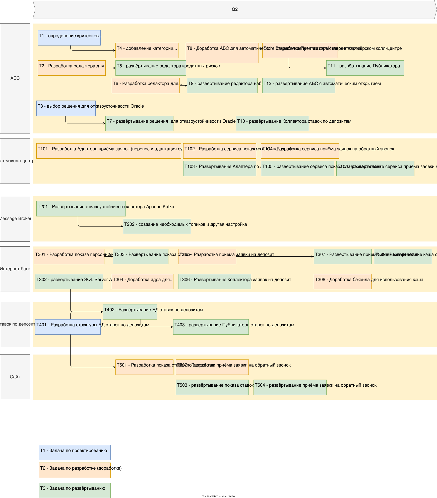

# Изменение ADR в связи с требованием предоставлять актуальные ставки сотрудников колл-центров.

На самом деле, это требование прямо упомянуто в исходной постановке задачи
("...Изучив заявку в системе кол-центра, менеджер может предложить особые
условия...", F3), поэтому необходимое решение уже присутствует в
[ADR задачи №3](../Task3/ADR.rst).

Примерный роадмап для MVP выглядит так:

Замечание: хотелось бы, конечно, чтобы задания учили хорошему, например,
оформлять документацию, такую как роадмапы в виде, пригодном для последующего
редактирования и отслеживания изменений. drawio таким форматом не является.
Хорошей альтернативы я, к сожалению, не знаю.